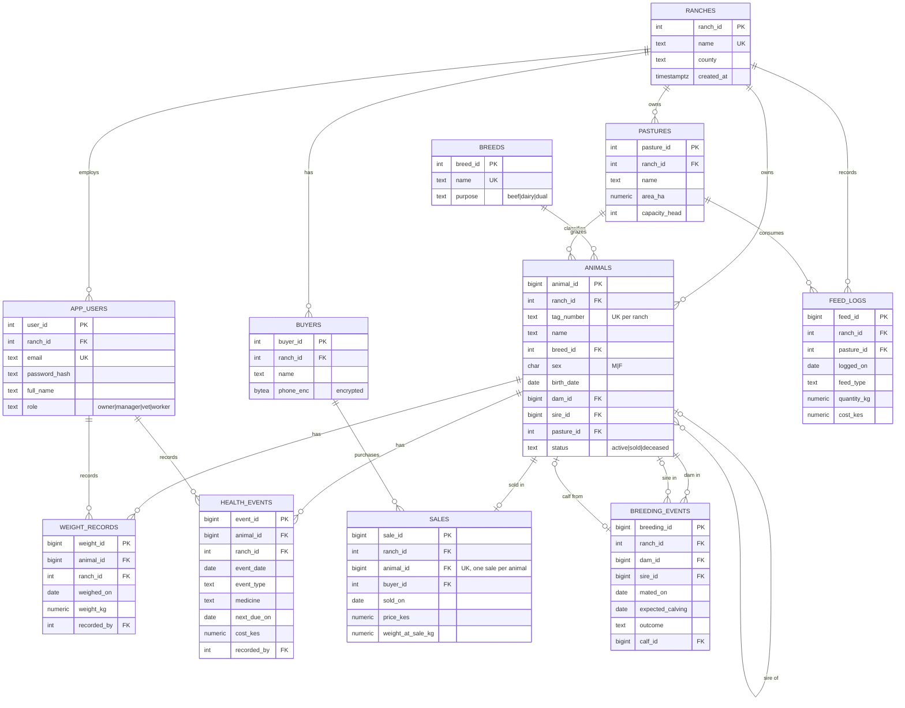

# Day 1: Requirements and ER Diagram

**Track:** Ndume Ranch, a multi-tenant cattle ranching management system
**Database:** `capstone` (PostgreSQL 16) plus Redis (cache and sessions) and MongoDB (sensor ingestion)

## 1. Requirements summary (one page)

**Problem.** Small and medium Kenyan cattle ranches track animals on paper or in spreadsheets. They lose weight history, miss vaccinations, can't tell which animals are profitable, and have no audit trail for who changed what. Ndume Ranch is one system that serves many ranches, each seeing only its own data.

**Users and roles.** `owner` (full access, sees finances), `manager` (day-to-day edits), `vet` (health records), `worker` (read-only plus weigh-ins and feed logs).

**Functional requirements**

| ID | Requirement |
|----|-------------|
| F1 | Register ranches, users and pastures. Each user belongs to exactly one ranch. |
| F2 | Register animals with tag number, breed, sex, birth date, dam/sire (pedigree) and current pasture. |
| F3 | Record weigh-ins over time per animal (growth tracking). |
| F4 | Record health events (vaccination, treatment, deworming, checkup) with cost. |
| F5 | Record breeding events and resulting calves. |
| F6 | Record feed use per pasture with cost. |
| F7 | Record sales to buyers (price, weight at sale). Sold animals leave the active herd. |
| F8 | Dashboards: herd size by breed/pasture, average daily gain, overdue vaccinations, margin per sold animal. |
| F9 | Every change to animals, sales and health events is audited (who, when, old and new values). |

**Non-functional requirements**

| ID | Requirement |
|----|-------------|
| N1 | Tenant isolation enforced by the database (row-level security), not only by the application. |
| N2 | Least privilege. The application never connects as a superuser. |
| N3 | Passwords stored hashed. Buyer phone numbers are protected from non-owner roles. |
| N4 | Dashboard queries under 100 ms at 1M weigh-in rows. Evidence in Day 4. |
| N5 | Daily backup with a verified test restore. |
| N6 | Schema reproducible from an empty database via ordered migrations. |

**Why a second and third store**

* **Redis**: herd dashboard cache, login sessions, rate limiting (short-lived, read-heavy, key-based).
* **MongoDB**: GPS/temperature collar readings (high-volume, append-only, schema varies by device vendor). Justification in `docs/03_nosql.md`.

**Out of scope:** payments processing, mobile app, multi-currency (all amounts in KES).

## 2. ER diagram

Rendered image: `docs/er_diagram.png`. Source below (Mermaid, paste into any Mermaid viewer or draw.io via *Arrange > Insert > Advanced > Mermaid*).

### Cardinality notes

* A ranch has many users, pastures, animals, buyers and feed logs (1 to many). Every child row carries `ranch_id`, which is the tenant key used by RLS.
* An animal has many weigh-ins and health events (1 to many) and at most one sale (1 to 0..1, enforced by a unique constraint).
* `dam_id` and `sire_id` are optional self-references (0..1 parent each, a parent has 0..many offspring). Foundation stock has no recorded parents.
* A breeding event has exactly one dam, an optional sire and an optional calf (the calf exists only after a successful birth).

## 3. Design decisions to review

1. **Tenant key on every table** (denormalised `ranch_id` on weights and health events) so RLS policies are a single cheap equality check with no joins.
2. **Pedigree via self-reference** instead of a separate pedigree table. Simpler, and recursive CTEs answer lineage questions.
3. **Soft status on animals** (`active|sold|deceased`) instead of deleting rows, to keep history and audit integrity.
4. **Sensor data not in PostgreSQL.** Collars can emit a reading every few minutes per animal. That volume and the vendor-specific payloads fit a document store better.
5. **Supporting table `audit_log`** (added in V3, not drawn: it references every audited table by name and key, not by foreign key).

## 4. Feedback checkpoint

The lab asks for feedback on this design **before** SQL is written. Share this file (or the PNG) with your instructor or a peer and note their comments in `docs/feedback_log.md`. The migrations in Day 2 follow this design as written, so if feedback changes it, update V1 and re-run migrations from empty.
